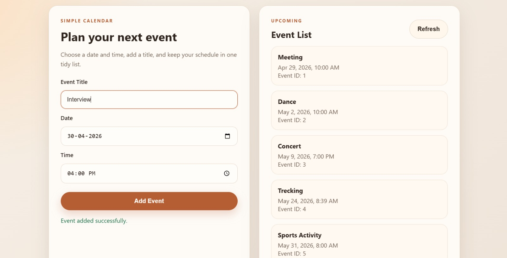

## 📸 Application Screenshot

# Simple Calendar App

A full-stack web application that allows users to create and view calendar events.

## 🚀 Features

* Add events with title, date, and time
* View all events
* Refresh to fetch latest events
* REST API backend using Spring Boot

## 🛠 Tech Stack

* Backend: Java, Spring Boot
* Database: MySQL
* Frontend: HTML, CSS, JavaScript

## ▶️ How to Run

1. Clone the repository
2. Configure MySQL in `application.properties`
3. Run Spring Boot application
4. Open browser: http://localhost:8080

## 📂 Database Setup

Run the `schema.sql` file in MySQL to create the events table.
